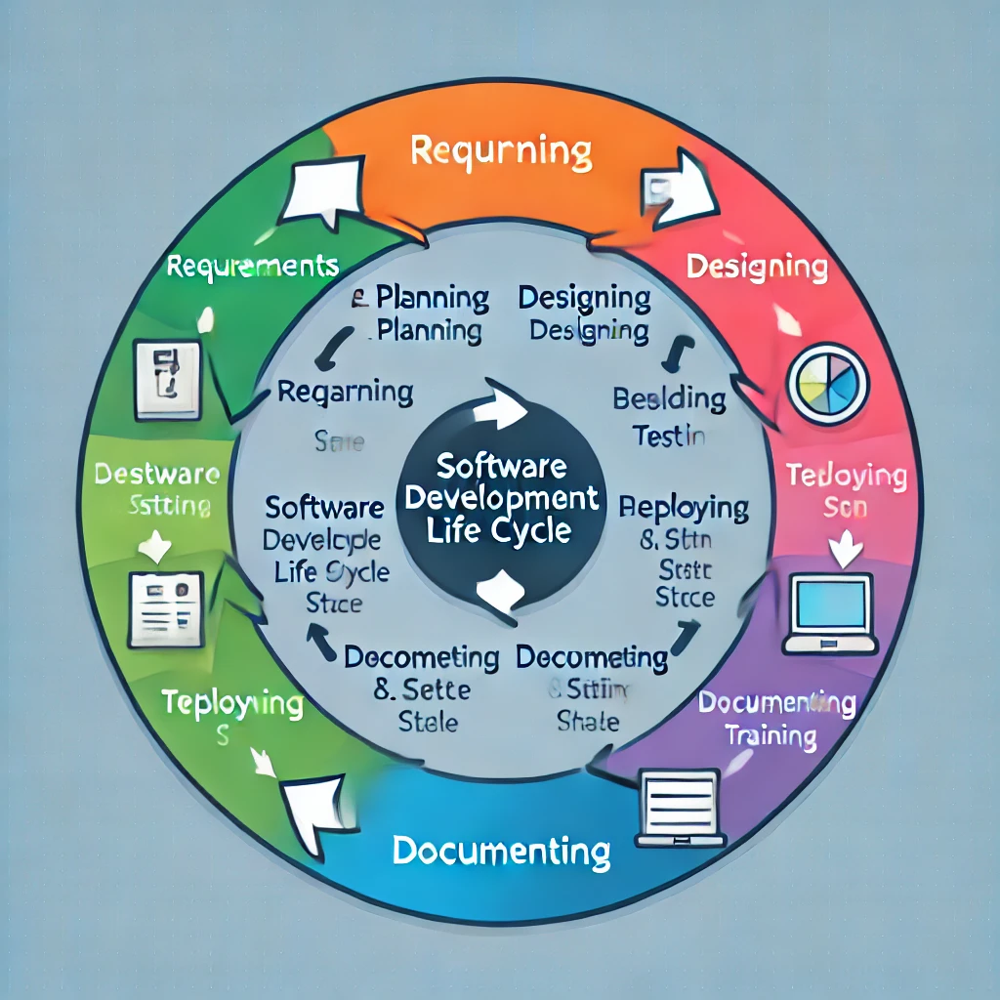

# DevOps and SDLC: A Beginner's Guide

## 1. Requirements:
- **What it is**: It's the stage where you gather all the things that the project needs to do. For example, if you're building an e-commerce website, you would list out things like product categories, checkout features, and payment options.
- **DevOps**: In traditional SDLC, requirements are set once at the start. In DevOps, it’s ongoing. Teams constantly refine and adjust requirements based on feedback.

## 2. Planning:
- **What it is**: In this phase, you plan how to approach building the software. You decide on tasks, create a timeline, and set goals.
- **DevOps**: Planning in DevOps is done in small cycles, often called sprints. You break down the work into manageable chunks (features) that can be delivered quickly. The focus is on flexibility and adaptability.

## 3. Designing:
- **What it is**: You design how the system will look and work. This includes the user interface (UI) and user experience (UX), as well as how the system architecture is set up.
- **DevOps**: In DevOps, developers, designers, and operations teams collaborate from the start. Instead of long design phases, feedback loops are faster, and designs are adaptable as development progresses.

## 4. Defining:
- **What it is**: Here, the team decides how the system should work at a technical level. They define all the technical details, like databases, APIs, and code architecture.
- **DevOps**: DevOps teams emphasize writing infrastructure as code. This means you define the server setups and cloud resources using scripts, so they are automatically created and configured when needed.

## 5. Building:
- **What it is**: In this phase, developers write the code to create the software. This can take a long time, depending on how complex the software is.
- **DevOps**: DevOps promotes continuous integration (CI), which means developers regularly add their code to the project. This way, there are fewer conflicts, and bugs are caught early.

## 6. Testing:
- **What it is**: This is when you check if the software works as expected. Testing helps find bugs or issues that need to be fixed.
- **DevOps**: Continuous testing is a major part of DevOps. Automated tests are run every time code changes are made, ensuring everything works as expected without delays.

## 7. Deploying:
- **What it is**: Deployment is the act of releasing the software to users (for example, putting a website live).
- **DevOps**: DevOps focuses on continuous deployment (CD), meaning software is deployed regularly and automatically. It’s much faster and more reliable than traditional deployment.

## 8. Documenting:
- **What it is**: This phase is about creating documentation (user manuals, developer guides, etc.) for the software.
- **DevOps**: In DevOps, documentation is kept up-to-date automatically, especially for things like setup and installation. Developers often document the code itself, and tools automatically generate documentation.

## 9. Training:
- **What it is**: This phase involves training users or other team members on how to use the system.
- **DevOps**: In DevOps, training happens continuously. Teams learn and adapt as they work, so there is no long training period at the end. Instead, everyone is constantly improving and learning new tools.

---

## What Makes DevOps Different?
- **Continuous Feedback**: Traditional development cycles have long feedback loops (weeks or months). DevOps works in shorter cycles, making feedback more frequent and immediate.
- **Collaboration**: DevOps breaks down silos between development (coding), operations (servers, deployment), and quality assurance (testing) teams. Everyone works together from the start, improving efficiency and communication.
- **Automation**: DevOps uses automation to streamline repetitive tasks like testing, building, and deploying. This means teams spend less time on manual work and more time on innovation.
- **Flexibility**: Traditional methods are rigid, but DevOps is flexible, adapting quickly to changes. It’s ideal for fast-paced projects or businesses that need to evolve frequently.

## Key DevOps Practices:
- **Version Control**: All code is stored in a version control system (like Git). It tracks changes and allows multiple people to work on the same code without conflicts.
- **CI/CD Pipelines**: Continuous Integration (CI) and Continuous Deployment (CD) automate the testing and deployment process to make software delivery faster and more reliable.
- **Monitoring and Logging**: DevOps teams monitor the software constantly, ensuring any issues are detected and resolved quickly. They use logs to track errors and system performance.
- **Collaboration Tools**: DevOps teams use tools like Slack, Jira, and Confluence for communication and project management.

## Conclusion:
DevOps makes the SDLC process faster, more efficient, and flexible. It helps teams deliver better software, more frequently, with fewer issues. It’s about continuous improvement, automation, and close collaboration across all teams involved.
