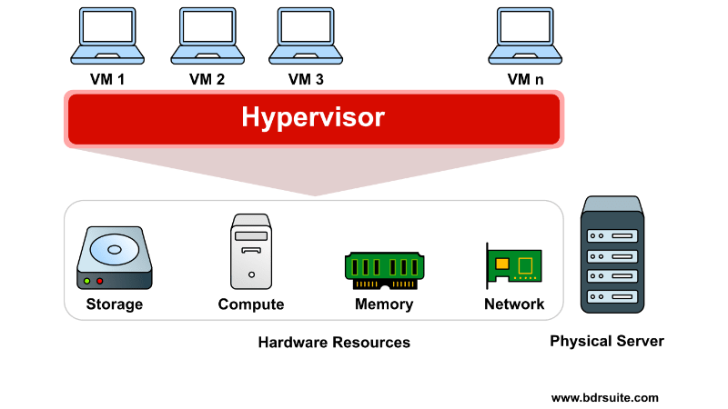

# Understanding Servers, Virtual Machines, Hypervisors, and AWS

## 1. What is a Server?
A **server** is a powerful computer that provides services or resources to other computers, known as clients, over a network. Servers store, manage, and process data, and can offer services like hosting websites, storing files, running applications, and more.

### Example:
Think of a website like Google. The Google search engine is hosted on a server. When you type something into Google and hit search, your computer (the client) makes a request to Google’s server, which processes that request and sends the result back to your screen.

---

## 2. What is a VM (Virtual Machine)?
A **Virtual Machine (VM)** is like a computer within a computer. It's a software-based simulation of a physical computer. A VM runs its own operating system and applications, just like a regular computer, but it uses the hardware resources of the physical computer (called the **host machine**).

### Example:
On your laptop, you could run a VM using software like VirtualBox or VMware. The VM could run a different operating system, such as Linux, while your laptop runs Windows.

---

## 3. What is a Hypervisor?
A **Hypervisor** is a special kind of software that enables a physical computer (host) to create and manage VMs. It acts as a bridge between the physical hardware and the VMs. The hypervisor ensures that each VM gets a portion of the physical resources, such as CPU, memory, and storage.

### Example:
If you use software like VMware or VirtualBox, those are hypervisors. They allow you to run multiple VMs on a single physical machine.

There are two types of hypervisors:
- **Type 1 (Bare Metal)**: Installed directly on the physical hardware (e.g., VMware ESXi).
- **Type 2 (Hosted)**: Runs on top of an operating system (e.g., VMware Workstation, VirtualBox).

---

## 4. Difference Between Physical and Virtual Machines

- **Physical Machine (PM)**: This is the actual hardware (computer) that runs the operating system and applications. It is a standalone machine with its own CPU, RAM, storage, etc.
- **Virtual Machine (VM)**: This is a simulated computer that runs on top of a physical machine, using the resources provided by the host machine.

### Key Differences:
- **Physical Machine**: One machine, one OS, and applications running on real hardware.
- **Virtual Machine**: Multiple VMs can run on a single physical machine, sharing the hardware resources. Each VM acts like a separate machine.

---

## 5. Advantages of Virtual Machines
- **Resource Efficiency**: You can run multiple VMs on a single physical machine, which optimizes hardware usage.
- **Isolation**: VMs are isolated from each other, so if one VM crashes, the others are not affected.
- **Flexibility**: You can quickly create, modify, or delete VMs as needed.
- **Cost Savings**: Virtualization allows you to run multiple operating systems and applications on one physical machine, reducing the need for additional hardware.
- **Portability**: You can move VMs from one host to another (e.g., between physical servers or data centers) easily.

---

## Real-time Example with AWS (Amazon Web Services)

Now, let's look at how these concepts apply in **AWS**:

- **AWS EC2 (Elastic Compute Cloud)** is a service that provides virtual machines (VMs) in the cloud. These VMs are known as **instances**.
- You can think of EC2 instances as VMs that run on AWS's physical servers. You can choose different types of instances with varying amounts of resources (CPU, memory, storage) based on your needs.
- **AWS Hypervisor**: AWS uses a hypervisor technology to run multiple EC2 instances on a single physical server. This allows you to create VMs (EC2 instances) with different configurations and operating systems (e.g., Linux, Windows) on the same hardware.

### Example Scenario:
- You have a small website and need a server to host it. Instead of buying a physical server, you can create an **EC2 instance** in AWS. This instance is a virtual machine that behaves like a real server. You don’t need to worry about the physical hardware; AWS manages that for you.
- If you need more power or storage, you can easily scale up your EC2 instance by changing its size (e.g., from a small instance to a larger one) without needing to buy new hardware.
- AWS provides a **Hypervisor** (called Xen or Nitro) to manage these EC2 instances on physical servers in AWS data centers.

---

## To Summarize:
- **Server**: A powerful computer that provides services (like web hosting).
- **VM (Virtual Machine)**: A simulated computer that runs on a physical machine using a hypervisor.
- **Hypervisor**: Software that manages multiple VMs on a physical machine.
- **Physical vs Virtual Machine**: Physical machines are real hardware, while virtual machines run on top of physical hardware through hypervisors.
- **Advantages of VMs**: Efficiency, isolation, flexibility, cost savings, and portability.

With AWS, you don’t need to worry about the physical server hardware. You simply create EC2 instances (virtual machines) to run your applications.

